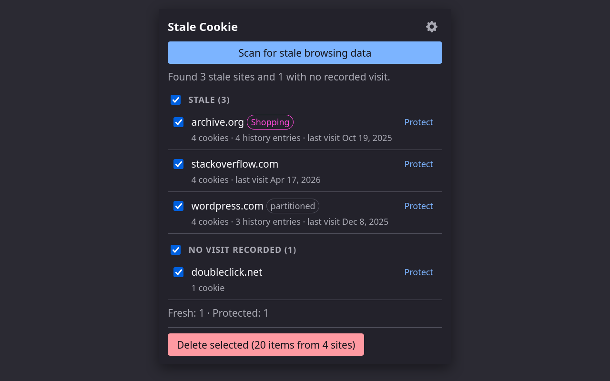

# Stale Cookie

Browser extension that clears stale browsing data — data belonging to sites you no longer visit — while preserving everything from the sites you use. For Firefox and Chrome.

## Install

<a href="#"></a>
<a href="#"></a>

*Store listings are not live yet — links will be added once published.*

Requires **Firefox 140+** (desktop only — see limitations) or **Chrome 123+**.

## What it does

- **Scan with preview**: finds cookies, browsing history and (optionally) download history from sites you haven't visited in a configurable number of days, grouped one row per site. Nothing is deleted without you seeing the list first.
- **Protected sites**: an explicit whitelist that no scan or clean ever touches.
- **Undo**: every deletion snapshots its cookies first — restorable for 24 hours while the browser stays open. (History and downloads are unrecoverable by nature; the preview says so before you confirm.)
- **Automatic cleaning** (opt-in): a scheduled clean of exactly what a manual preview would pre-select, recorded in the action log.
- **Reminders** (manual mode): a toolbar badge — and, optionally, a system notification — when it's time to clean.
- **Action log and error log**: a local record of what was deleted (kept for 30 days), exportable as JSONL with an anonymize option for bug reports.
- **Firefox niceties**: container cookies (per-container stores) and partitioned (CHIPS) cookies are handled and labeled in the preview.



## Privacy

No network requests, ever. No telemetry. Everything the extension needs to work is stored locally in your browser and never leaves it. Error reporting is manual: you export the log yourself and attach it wherever you choose — the export anonymizes site names by default. Full policy: [PRIVACY.md](PRIVACY.md).

## Why these permissions

The permission list is broad because the job is deleting data across every site you have ever visited — but the surface is small:

- **Access your data for all websites** (`<all_urls>`) — the cookies API requires host access to enumerate and delete cookies for arbitrary domains. The extension runs **no content scripts**: it never reads, injects into, or modifies any page.
- **cookies** — list and delete cookies, including container and partitioned (CHIPS) stores.
- **history** — the *only* source of "when did I last visit this site" (the extension keeps no visit records of its own), plus per-URL deletion of stale history.
- **contextualIdentities** (Firefox only) — list containers, so cookies in containers with no open tabs aren't missed.
- **storage**, **alarms** — settings, action log, and the reminder/automatic-cleaning schedule.
- Optional, requested only when you enable the feature: **downloads** (download-history cleaning), **browsingData** (the global cache/form-data clear), **notifications** (reminder notification).

There is no `webRequest`, no content script, and no network access of any kind.

## Known limitations

- **Firefox only exposes the current session's downloads** to extensions ([Bug 1255507](https://bugzilla.mozilla.org/show_bug.cgi?id=1255507)) — download entries from before the last browser start can't be listed or deleted per site.
- **Cache and form data can only be cleared globally**, not per site — the browsers offer no per-site API. That's why they live in a separate "global clear" with its own explicit confirmation.
- **No Firefox for Android** — the `history` permission is desktop-only there, and history is what staleness is derived from.
- **Undo covers cookies only**, for 24 hours and only while the browser stays open. Deleted history and download entries are unrecoverable — the delete confirmation says so before you commit.
- Sites are matched by registrable domain: visiting `mail.google.com` keeps all `google.com` data fresh.
- **Automatic cleaning has no preview** by design; the action log is its record, and the whitelist always protects.

## FAQ

**Why was I logged out of a site?**
Deleting a site's cookies deletes its login session. Stale Cookie only ever previews-then-deletes sites you haven't visited in a long time (90 days by default for cookies), but if a site you care about shows up in the preview, uncheck it or hit Protect — protected sites are never touched, including by automatic cleaning. Deleted cookies can be restored for 24 hours (while the browser stays open) with the Restore button.

**Is any of my data sent anywhere?**
No. The extension makes no network requests at all — see [PRIVACY.md](PRIVACY.md).

**Does deleting download history delete the downloaded files?**
No. It removes entries from the browser's download list only; files on disk are never touched.

**Why was nothing preselected after a fresh install?**
With no browsing history at all there's no signal to distinguish stale from fresh, so the scan preselects nothing rather than guessing.

**Why don't my older downloads show up on Firefox?**
See known limitations — Firefox only lets extensions see the current session's downloads.

## Building from source

Reproducible from a clean checkout; no network access is needed beyond `npm ci`.

- **Environment**: Linux, Node 20 (built with v20.15.1, see `.nvmrc`), npm 10 (10.8.2).

```sh
npm ci
npm run build        # emits dist/ (Firefox) and dist-chrome/ (Chrome)
```

`dist/` is the Firefox extension; `dist-chrome/` is the same bundle with a Chrome-specific manifest. To produce the packaged Firefox artifact (what gets uploaded to AMO):

```sh
npx web-ext build --source-dir dist   # writes web-ext-artifacts/*.zip
```

The icons in `src/icons/` are pre-rendered and checked in, so the normal build has no image tooling dependency. Re-rendering them from `assets/icon.svg` (`npm run build:icons`) is only needed if the icon changes and requires ImageMagick (the legacy `convert` command).

## Development

```sh
npm run dev              # rebuild on change
npm test                 # unit tests (vitest)
npm run test:integration # drives the built extension in headless Firefox + Chrome (throwaway profiles)
npm run typecheck        # tsc --noEmit
npm run lint:ext         # web-ext lint against dist/
```

For manual testing, load `dist/manifest.json` as a temporary add-on via `about:debugging` (Firefox) or `dist-chrome/` via chrome://extensions → Load unpacked (Chrome). Never test against a real browser profile — deletion is irreversible; the integration tests use throwaway profiles created and destroyed per run.

Contributions are welcome within the project's deliberately limited scope — read [CONTRIBUTING.md](CONTRIBUTING.md) first.

## Reporting bugs

Open an issue at <https://github.com/SergioMartinezCid/stale-cookie/issues>. If something went wrong, attach the log export (options page → Logs → Export logs): it anonymizes site names by default, so it's safe to share. For security vulnerabilities, please use private reporting instead — see [SECURITY.md](SECURITY.md).

## License

[MIT](LICENSE). Bundled third-party code (tldts, webextension-polyfill) is covered by [THIRD_PARTY_NOTICES.md](THIRD_PARTY_NOTICES.md), which also ships inside the extension package.
